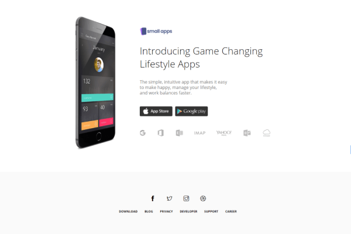
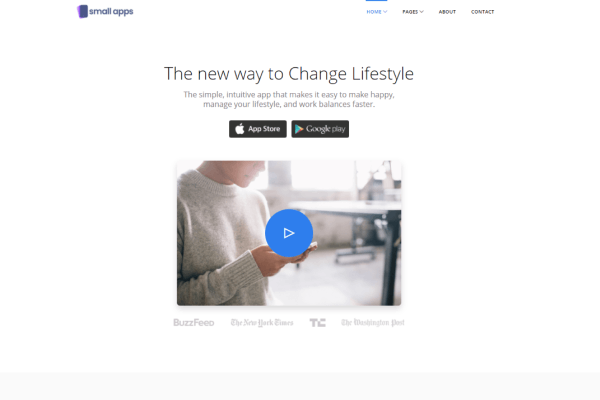
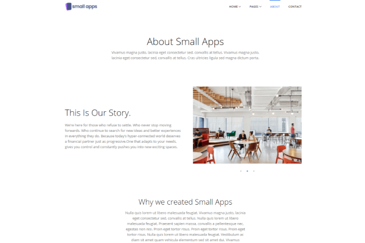
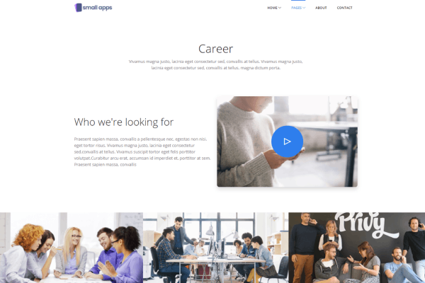
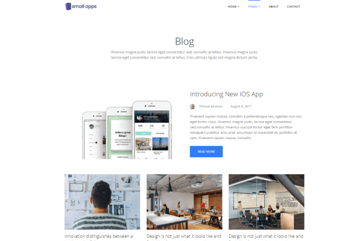
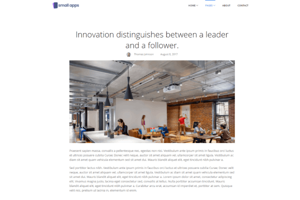
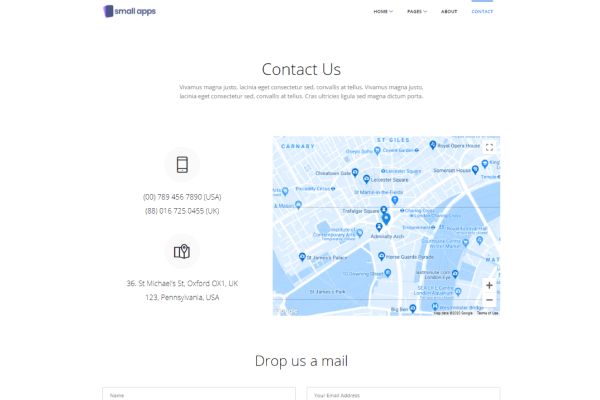

# Overview of CICD Plan
The idea was to develop and test a MIT licensed multipage Bootstrap/JavaScript template repository so that it could be easily replicated and deployed for future website development. Any changes to the website should automatically trigger a test before it is merged into the project. 

# GitHub Demo
The website can be viewed at https://gurby123.github.io/AppBootStrap/
The images on this website are not free and are only for demo purposes. 

# WorkFlow
The website was retrieved for a Themefisher demo with an MIT license. The workflow file was added to monitor and test it before deployment. It was tested on Node.js 12.x, 14.x and 16.x. So far the tests have all failed. I am still on completing the integration stage so that I can progress to the deployment phase at a private server. 

# Docker1 

The Docker file with ALPINE and python broke the images and hyperlinks of the website giving a skeletal website witohut the bells and wistles of CSS and SASS. 

Dockerfile code was as follows:
FROM alpine
MAINTAINER uli.hitzel@gmail.com
EXPOSE 8080
RUN apk update
RUN apk add python2
COPY index.html /tmp/index.html
COPY start.sh /tmp/start.sh
USER 1000
CMD ["sh","/tmp/start.sh"]

start.sh was as follows: 
cd /tmp
mkdir www
cp index.html www
echo "<hr>Running on $(hostname)" >> www/index.html
cd www
python -m SimpleHTTPServer 8080

Docker Build command was as follows:
docker build . -t  appbootstrap

Docker run command was as follows:
docker run -d -p 8080:8080 appbootstrap

# Docker2
Still install python to display index.html but also installed node.js, npm and gulp. There was no inprovement with navigating hyperlinks, images and CSS

The Dockerfile code is as follows:
FROM mhart/alpine-node:latest

RUN apk update
RUN apk add python2	

WORKDIR /usr/src/app
RUN apk add --update nodejs nodejs-npm
COPY package*.json ./
RUN  npm install

RUN npm install -g gulp

COPY index.html /tmp/index.html
COPY start.sh /tmp/start.sh
USER 1000
CMD ["sh","/tmp/start.sh"]

Docker build command:
docker build . -t  appbootstrap3

Docker run command:
docker run -d -p 8080:8080 appbootstrap3

# Docker3

FROM ubuntu:18.04
MAINTAINER uli.hitzel@gmail.com
EXPOSE 8080
ARG DEBIAN_FRONTEND=noninteractive
ENV TZ=Asia/Singapore

RUN apt-get update
RUN apt-get install -y nodejs npm
ENV USER root
RUN npm install -g express-generator
RUN npm install express --save
RUN useradd -ms /bin/bash user
COPY app.js /home/user/app.js
COPY start.sh /home/user/start.sh
RUN chmod a+x /home/user/start.sh
USER user
WORKDIR /home/user

CMD ["sh","/home/user/start.sh"]

# Lessons Learned

Even though the demo HTML website works out of the box, because of it bootstrap features, it tends to fails with numerous node.js dependencies that have been deprecated. A related problem is that the global gulp.cli needs to be installed and it requires the sudo command. It may therefore not be practical or possible to create a docker image in the normal way and as the gulp dependecy may need to be pre-installed in the linux distro. 


# Small Apps By Themefisher
Small Apps is a clean and modern Free responsive app landing-page template for Mobile App. Built with Bootstrap 4.x frontend Framework. The codebase is well organized, very easy to customize, and SEO optimized.


<!-- demo -->
## Example Site
| [](https://demo.themefisher.com/small-apps/) | [](http://localhost:3000/homepage-2.html) | [](https://demo.themefisher.com/small-apps/homepage-3.html) |
|:---:|:---:|:---:|
| **Homepage 1**  | **Homepage 2**  | **Homepage 3**  |
| [](https://demo.themefisher.com/small-apps/about.html) | [](https://demo.themefisher.com/small-apps/career.html) | [](https://demo.themefisher.com/small-apps/team.html) |
| **About** | **Career** | **Team** |
| [](https://demo.themefisher.com/small-apps/blog.html) | [](https://demo.themefisher.com/small-apps/blog-single.html) | [](https://demo.themefisher.com/small-apps/contact.html) |
| **Blogs** | **Blog Details** | **Contact** |

👉🏻[View Live Preview](https://demo.themefisher.com/small-apps/)

<!-- resources -->
## Pages
* **Homepage 1**
* **Homepage 2**
* **Homepage 3**
* **About**
* **Team**
* **Career**
* **Blog**
* **Blog Details**
* **Contact**
* **FAQ**
* **Coming Soon**
* **404**
* **Privacy Policy**
* **Signin**
* **Signup**


<!-- download -->
## Download And installation
Download this template from any following options:

* Download from [Github](https://github.com/themefisher/Small-Apps-Bootstrap-App-Landing-Template/archive/master.zip)
* Clone the repository: `git clone https://github.com/themefisher/Small-Apps-Bootstrap-App-Landing-Template.git`
* Download from [Themefisher](https://themefisher.com/products/small-apps-free-app-landing-page-template/)


<!-- installation -->
### Basic Usage
After downloading template, you can simply edit the HTML and CSS files from the `theme` folder. To preview the changes you make to the code, you can open the index.html file in your web browser.

### Advanced Usage
For advanced usage you have some dependencies to install. Then you can run it on your localhost. You can view the package.json file to see which scripts are included.

#### Install Dependencies
* **Node Installation:** [Install node js](https://nodejs.org/en/download/)
* **Gulp Installation:** Install gulp globally from your terminal 
```
npm install --global gulp-cli
```
Or visit original [docs](https://gulpjs.com/docs/en/getting-started/quick-start)

#### Run Theme
After succesfully install those dependencies, open this theme with any IDE [[VS Code](https://code.visualstudio.com/) recommended], and then open internal terminal of IDE [vs code shortcut <code>ctrl/cmd+\`</code>]

* Install node package modules
```
npm install
```
* Run gulp
```
gulp
```
After that, it will open up a preview of the template in your default browser, watch for changes to core template files, and live reload the browser when changes are saved.

👉🏻 [visit documentation](https://docs.themefisher.com/airspace/)


<!-- reporting issue -->
## Reporting Issues
We use GitHub Issues as the official bug tracker for the Small Apps Template. Please Search [existing issues](https://github.com/themefisher/Small-Apps-Bootstrap-App-Landing-Template/issues). It’s possible someone has already reported the same problem.
If your problem or idea has not been addressed yet, feel free to [open a new issue](https://github.com/themefisher/Small-Apps-Bootstrap-App-Landing-Template/issues).

<!-- support -->
## Technical Support or Questions (Paid)
If you have questions or need help integrating the product please [contact us](mailto:mehedi@themefisher.com) instead of opening an issue.

<!-- licence -->
## License
Copyright &copy; 2021 Designed & Developed by [Themefisher](https://themefisher.com)

**Code License:** Released under the [MIT](https://github.com/themefisher/Small-Apps-Bootstrap-App-Landing-Template/blob/master/LICENSE) license.

**Image license:** The images are only for demonstration purposes. They have their own licence, we don't have permission to share those image.

<!-- resources -->
## Resources
Some third-party plugins that we used to build this template. Please check their licence.
* **Bootstrap v4.5**: https://getbootstrap.com/docs/4.5/getting-started/introduction/
* **Jquery v3.5.1**: https://jquery.com/download/
* **Themify Icons**: https://themify.me/themify-icons
* **Google Fonts**: http://fonts.google.com/
* **AOS**: https://michalsnik.github.io/aos/
* **Fancybox**: http://fancyapps.com/fancybox/
* **Slick**: https://kenwheeler.github.io/slick/
* **SyoTimer**: http://syomochkin.xyz/folio/syotimer/demo.html